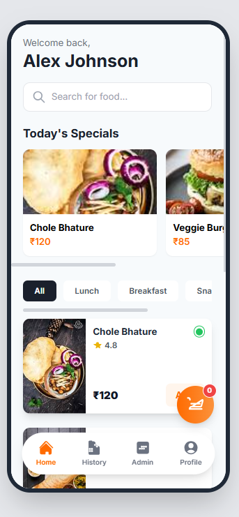
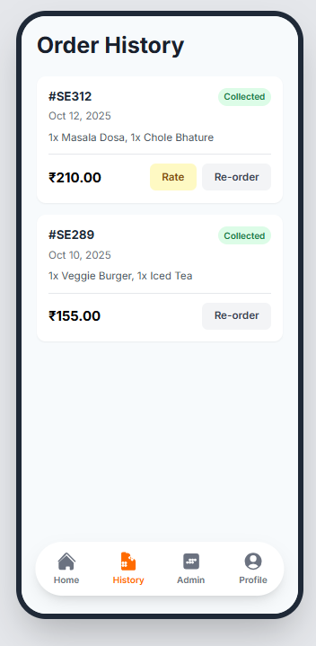
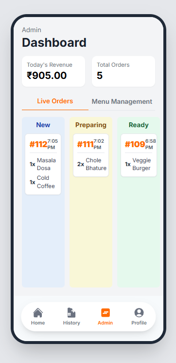

**SmartEats Prototype**

**Description**

SmartEats Prototype is a digital cafeteria food ordering system built to make the meal experience faster and more convenient. It enables users to explore menus, place orders digitally, and track them in real-time — eliminating long queues and reducing manual workload for cafeteria staff.

💡 **Importance**

The SmartEats Prototype plays a vital role in modernizing traditional cafeterias.
It helps improve time efficiency, minimizes order errors, ensures smooth coordination between users and kitchen staff, and promotes a cashless, organized food service environment.

✨ **Features and Their Uses**

📋 Digital Menu: Displays all available food items with names, prices, and details for easy selection.

🛒 Quick Ordering: Allows users to place orders instantly without standing in line.

⏱️ Real-Time Order Tracking: Lets customers check the live status of their orders.

💳 Cashless Payment: Enables secure online payment for convenience and safety.

🔔 Instant Notifications: Alerts users when their order is prepared or ready for pickup.

⚙️ Admin Management: Allows staff to manage orders, update menus, and monitor inventory efficiently.
